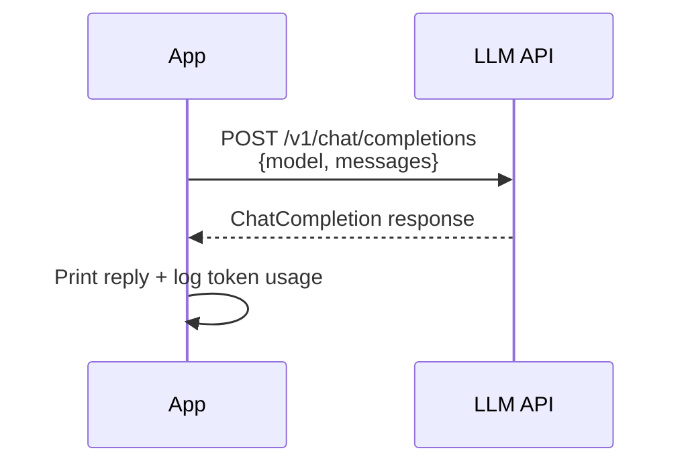
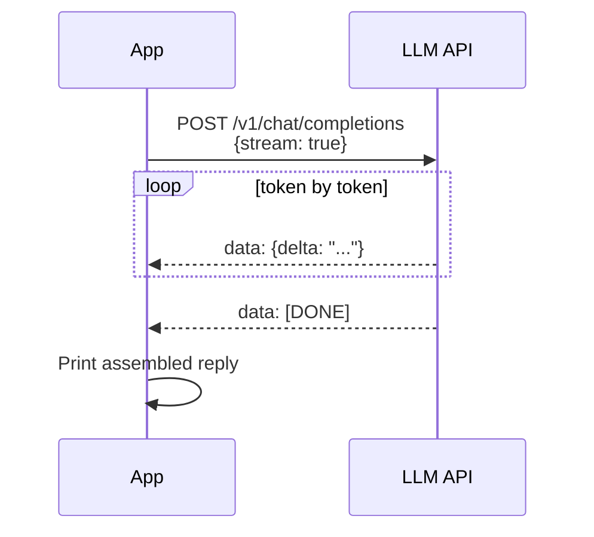
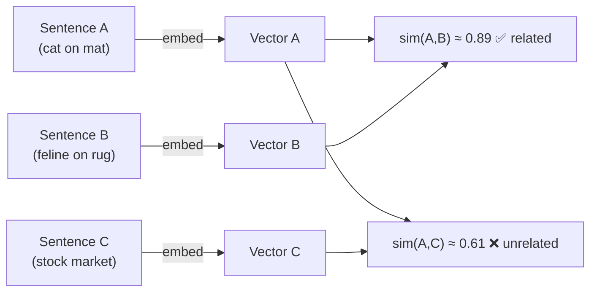
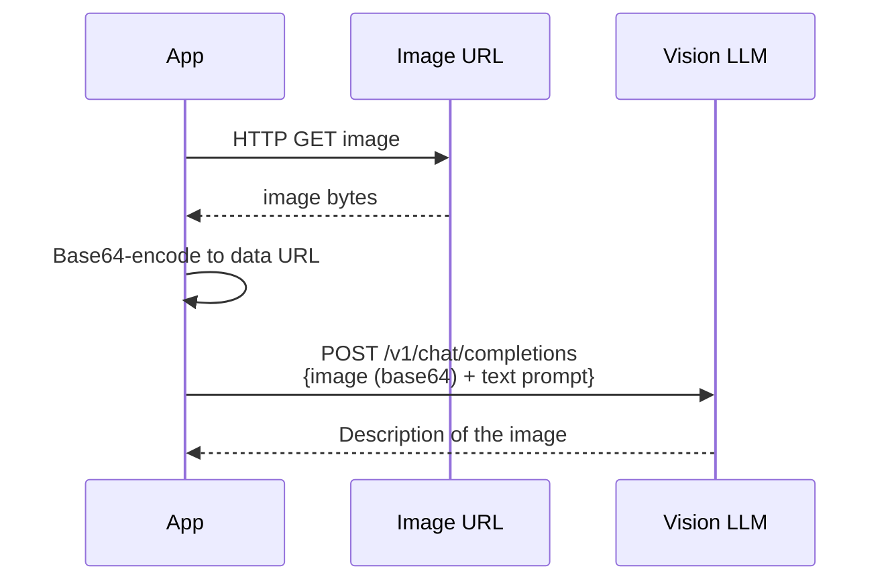
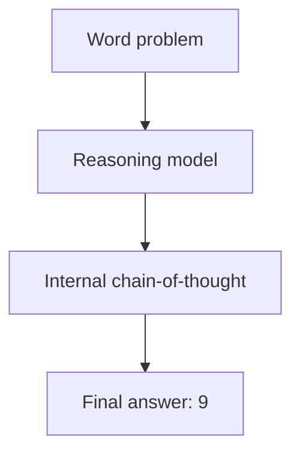
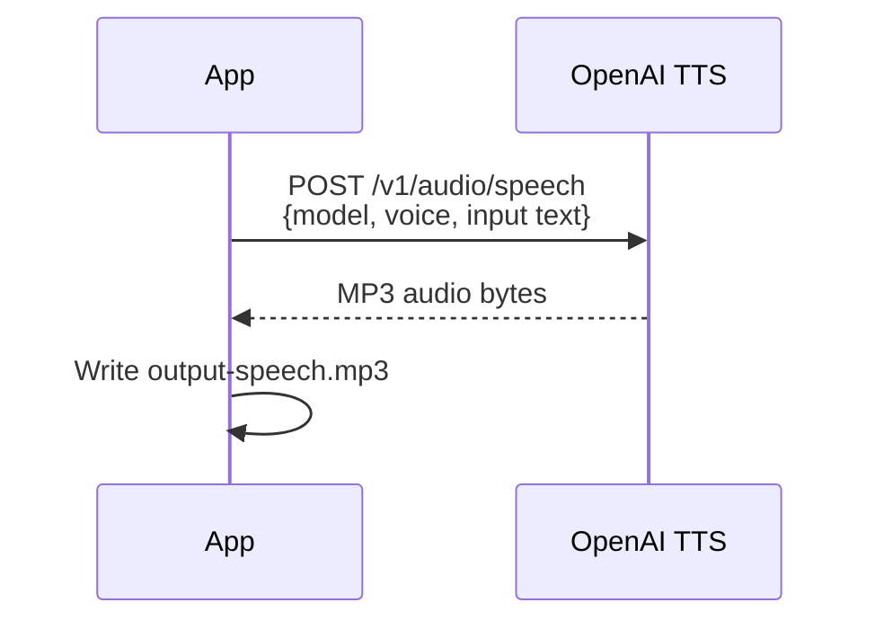
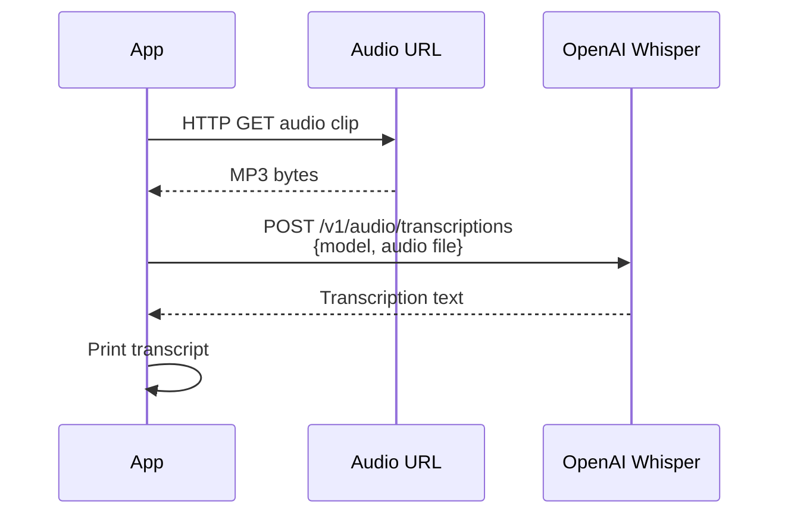
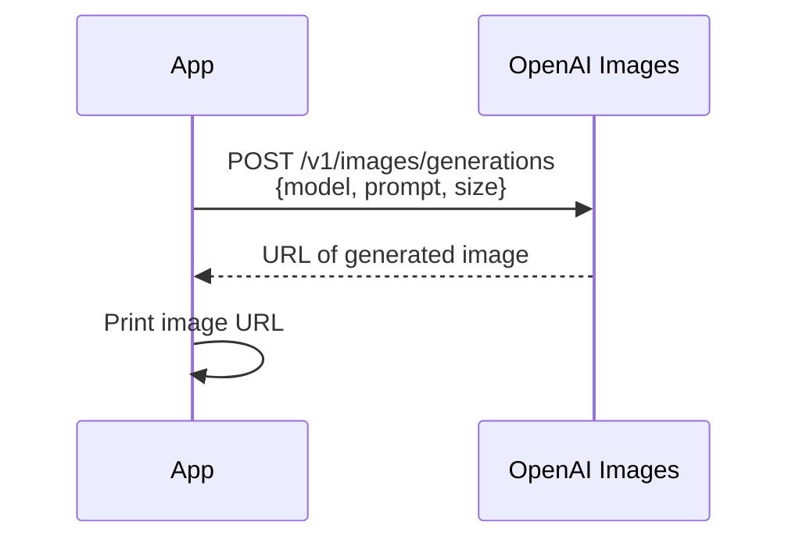
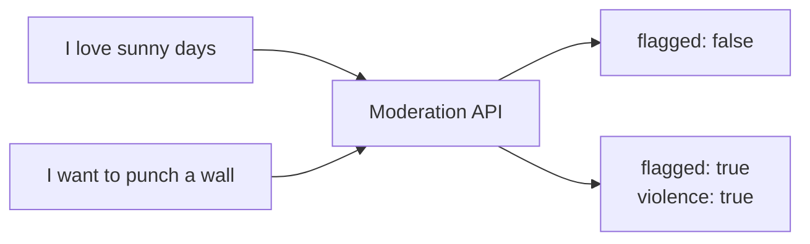

# JavaOpenAI

A hands-on Java 21 tutorial for the [OpenAI API](https://platform.openai.com/docs/api-reference), using the official first-party SDK [`com.openai:openai-java`](https://github.com/openai/openai-java).

Covers the full API surface — **chat**, **streaming**, **embeddings**, **vision**, **reasoning**, **text-to-speech**, **speech-to-text**, **image generation**, and **content moderation** — working against both the OpenAI cloud and any OpenAI-compatible local LLM server via a configurable base URL.

---

## API Coverage

| Command | API | Example local model | Example cloud model |
|---|---|---|---|
| `chat` | Chat Completions (sync) | `llama3.2:3b` | `gpt-4o-mini` |
| `stream` | Chat Completions (streaming SSE) | `llama3.2:3b` | `gpt-4o-mini` |
| `embed` | Embeddings | `llama3.2:3b` | `text-embedding-3-small` |
| `vision` | Chat Completions (multi-modal image+text) | `llama3.2-vision:latest` | `gpt-4o-mini` |
| `reason` | Chat Completions (extended reasoning) | `qwq:latest` | `o4-mini` |
| `tts` | Audio Speech (text-to-speech) | ❌ not supported locally | `tts-1` |
| `stt` | Audio Transcriptions (speech-to-text) | ❌ not supported locally | `whisper-1` |
| `imagegen` | Images (DALL·E / image generation) | ❌ not supported locally | `dall-e-2` |
| `moderate` | Moderations (content classification) | ❌ not supported locally | `omni-moderation-latest` |

> Pull a local model with e.g. `ollama pull llama3.2:3b` — then set `OPENAI_MODEL=llama3.2:3b` and point `OPENAI_BASE_URL` at your server. For cloud commands, an OpenAI API key is required.

---

## Prerequisites

- **Java 21** — [download](https://adoptium.net/temurin/releases/?version=21) or install via your package manager
- **Maven 3.9+** — [download](https://maven.apache.org/download.cgi)

> On this machine, Java and Maven can be added to the `PATH` for the current session by running:
> ```cmd
> D:\Development\SetupEnvJava21.cmd
> D:\Development\SetupEnvMaven.cmd
> ```
> These are local convenience scripts — they are not required on other machines where Java 21 and Maven are already on the `PATH`.

---

## Configuration

Copy one of the ready-made templates to `src/main/resources/config.properties`:

| Template | Provider | Copy command |
|---|---|---|
| `config.properties.openai` | OpenAI cloud | `copy config.properties.openai config.properties` |
| `config.properties.ollama` | Ollama (local) | `copy config.properties.ollama config.properties` |
| `config.properties.lmstudio` | LM Studio (local) | `copy config.properties.lmstudio config.properties` |
| `config.properties.example` | Generic template | `copy config.properties.example config.properties` |

> `config.properties` is gitignored and will never be committed. All templates are in `src/main/resources/`.

The full set of configuration keys (leave a value empty if that feature is not available at your provider):

| Key | Used by | Default |
|---|---|---|
| `OPENAI_BASE_URL` | all | `https://api.openai.com/v1` |
| `OPENAI_API_KEY` | all | *(none)* |
| `OPENAI_MODEL` | `chat`, `stream`, `vision`, `embed` | `gpt-4o-mini` |
| `OPENAI_EMBEDDING_MODEL` | `embed` | `text-embedding-3-small` |
| `OPENAI_REASONING_MODEL` | `reason` | `o4-mini` |
| `OPENAI_TTS_MODEL` | `tts` | `tts-1` |
| `OPENAI_STT_MODEL` | `stt` | `whisper-1` |
| `OPENAI_IMAGE_MODEL` | `imagegen` | `dall-e-2` |
| `OPENAI_MODERATION_MODEL` | `moderate` | `omni-moderation-latest` |

Environment variables with the same names take priority over `config.properties`.

---

## Build

```cmd
# Compile, run tests, and produce the uber-jar:
mvn clean install

# Include source jar:
mvn clean source:jar install

# Skip tests (faster):
mvn clean install -DskipTests

# Run tests only (no package):
mvn test
```

The uber-jar is produced at `target/JavaOpenAI-1.0.0.jar`. It contains all dependencies and is self-contained.

---

## Running the Examples

All examples share the same launcher:

```cmd
java -jar target/JavaOpenAI-1.0.0.jar <command>
```

---

### `config` — Show resolved settings

```cmd
java -jar target/JavaOpenAI-1.0.0.jar config
```

Prints all resolved configuration values (API key masked). Run this first to verify your `config.properties` is loaded correctly before making any API calls.

---

### `chat` — Synchronous chat completion

```cmd
java -jar target/JavaOpenAI-1.0.0.jar chat
```

**What it does:** Sends a hardcoded question ("What is the capital of France?") to the model and prints the reply. Uses the blocking (synchronous) Chat Completions API — the full response arrives in one go.



> Models: set `OPENAI_MODEL` — e.g. `llama3.2:3b` locally or `gpt-4o-mini` on OpenAI.

---

### `stream` — Streaming chat completion

```cmd
java -jar target/JavaOpenAI-1.0.0.jar stream
```

**What it does:** Sends the same question but uses Server-Sent Events (SSE) streaming. Tokens appear one by one as they are generated, demonstrating how to build a real-time "typewriter" effect in a Java application.



> Uses `StreamResponse<ChatCompletionChunk>` — iterable with a standard for-each.

---

### `embed` — Embeddings and cosine similarity

```cmd
java -jar target/JavaOpenAI-1.0.0.jar embed
```

**What it does:** Converts three sentences into embedding vectors and computes cosine similarity between them. Demonstrates that semantically related sentences are "closer" in vector space than unrelated ones.



> Set `OPENAI_EMBEDDING_MODEL` — e.g. `llama3.2:3b` locally or `text-embedding-3-small` on OpenAI.

---

### `vision` — Multi-modal image + text

```cmd
java -jar target/JavaOpenAI-1.0.0.jar vision
java -jar target/JavaOpenAI-1.0.0.jar vision https://example.com/image.jpg
```

**What it does:** Downloads an image (default: a public Wikipedia PNG), encodes it as a Base64 data URL, and sends it alongside a text prompt asking the model to describe what it sees. Using Base64 ensures local servers — which cannot fetch external URLs themselves — also work.



> Set `OPENAI_MODEL` to a vision-capable model — e.g. `llama3.2-vision:latest` or `gpt-4o-mini`.

---

### `reason` — Reasoning / chain-of-thought

```cmd
java -jar target/JavaOpenAI-1.0.0.jar reason
```

**What it does:** Poses a classic word problem ("A farmer has 17 sheep. All but 9 die. How many are left?") and asks the model to show its step-by-step reasoning before giving the final answer. Reasoning-capable models (o1/o3/QwQ-style) produce an internal chain-of-thought before responding.



> Set `OPENAI_REASONING_MODEL` — e.g. `qwq:latest` locally or `o4-mini` on OpenAI. Defaults to `o4-mini` if not set.

---

### `tts` — Text-to-speech

```cmd
java -jar target/JavaOpenAI-1.0.0.jar tts
```

**What it does:** Sends a short text string to the OpenAI Audio Speech endpoint and writes the synthesised speech to `output-speech.mp3` in the current directory.



> **Requires OpenAI cloud.** Set `OPENAI_TTS_MODEL` (default `tts-1`). Local servers do not implement this endpoint.

---

### `stt` — Speech-to-text (Whisper)

```cmd
java -jar target/JavaOpenAI-1.0.0.jar stt
```

**What it does:** Downloads a short public-domain audio clip, sends it to the Whisper transcription endpoint, and prints the recognised text.



> **Requires OpenAI cloud.** Set `OPENAI_STT_MODEL` (default `whisper-1`). Local servers do not implement this endpoint.

---

### `imagegen` — Image generation (DALL·E)

```cmd
java -jar target/JavaOpenAI-1.0.0.jar imagegen
```

**What it does:** Sends a text prompt ("A serene mountain lake at sunrise") to the DALL·E image generation endpoint and prints the URL of the generated image.



> **Requires OpenAI cloud.** Set `OPENAI_IMAGE_MODEL` (default `dall-e-2`). Local servers do not implement this endpoint.

---

### `moderate` — Content moderation

```cmd
java -jar target/JavaOpenAI-1.0.0.jar moderate
```

**What it does:** Sends two sentences (one benign, one borderline) through the moderation endpoint and prints which content categories were flagged. Useful for understanding how to integrate content safety checks into an application.



> **Requires OpenAI cloud.** Set `OPENAI_MODERATION_MODEL` (default `omni-moderation-latest`). Local servers do not implement this endpoint.

---

## Running the Tests

Integration tests load connection details from `src/test/resources/test.properties` (gitignored). Copy `test.properties.example` to `test.properties` and configure it:

```properties
test.base.url=http://localhost:11434/v1
test.api.key=local
test.model=llama3.2:3b
test.vision.model=          # leave blank to skip the vision test
test.reasoning.model=          # leave blank to skip the reasoning test
test.audio.enabled=false       # set true for OpenAI cloud
test.image.generation.enabled=false
test.moderation.enabled=false
```

Run all tests:

```cmd
mvn test
```

Run a single test method:

```cmd
mvn test -Dtest=JavaOpenAIIntegrationTest#chat_completionReturnsNonEmptyReply
```

---

## Local Server Setup

Any OpenAI-compatible local server works. Use one of the ready-made config templates:

| Server | Default base URL | Config template |
|---|---|---|
| [Ollama](https://ollama.com) | `http://localhost:11434/v1` | `config.properties.ollama` |
| [LM Studio](https://lmstudio.ai) | `http://localhost:1234/v1` | `config.properties.lmstudio` |

**Ollama quick-start:**

```cmd
ollama pull llama3.2:3b            # chat, stream, embed
ollama pull llama3.2-vision:latest # vision
ollama pull qwq:latest             # reasoning (optional)
copy src\main\resources\config.properties.ollama src\main\resources\config.properties
```

**LM Studio quick-start:**

1. Download from [lmstudio.ai](https://lmstudio.ai) and load a model
2. Start the local server (default port 1234)
3. ```cmd
   copy src\main\resources\config.properties.lmstudio src\main\resources\config.properties
   ```
4. Edit `config.properties` and set `OPENAI_MODEL` to the model name shown in LM Studio

---

## Cloud Provider Setup

Cloud providers give access to all commands including TTS, STT, image generation and moderation. Use the ready-made config template and add your API key.

### OpenAI

Supports all 9 commands.

```cmd
copy src\main\resources\config.properties.openai src\main\resources\config.properties
```

Then edit `config.properties` and replace `sk-...` with your real API key from [platform.openai.com/api-keys](https://platform.openai.com/api-keys).

| API coverage | Notes |
|---|---|
| chat, stream, vision, embed, reason | ✅ Full support |
| tts, stt, imagegen, moderate | ✅ Full support |

### Other OpenAI-compatible cloud providers

Any provider that exposes an OpenAI-compatible REST API works with this project — just point `OPENAI_BASE_URL` at their endpoint and set the appropriate `OPENAI_API_KEY`.

| Provider | Base URL | Notes |
|---|---|---|
| [Azure OpenAI](https://azure.microsoft.com/en-us/products/ai-services/openai-service) | `https://<resource>.openai.azure.com/openai/deployments/<deployment>` | Same models as OpenAI |
| [Groq](https://console.groq.com) | `https://api.groq.com/openai/v1` | Very fast inference, free tier available |
| [Together AI](https://www.together.ai) | `https://api.together.xyz/v1` | Many open-source models |
| [Mistral AI](https://console.mistral.ai) | `https://api.mistral.ai/v1` | Mistral & Codestral models |
| [OpenRouter](https://openrouter.ai) | `https://openrouter.ai/api/v1` | Unified access to 100+ models |

For any of these, create a `config.properties` based on `config.properties.example`, set `OPENAI_BASE_URL` and `OPENAI_API_KEY`, and fill in the model names supported by that provider.

---

## Project Structure

```
src/main/java/edu/java/
├── JavaOpenAI.java                      # Entry point — command dispatcher
├── api/
│   ├── Config.java                      # Config loader (env vars → config.properties → defaults)
│   └── ClientFactory.java               # Builds the OpenAIClient
├── examples/
│   ├── ChatExample.java                 # Synchronous chat completion
│   ├── StreamingExample.java            # Streaming (SSE) chat completion
│   ├── EmbeddingsExample.java           # Embeddings + cosine similarity
│   ├── VisionExample.java               # Multi-modal vision (Base64 image)
│   ├── ReasoningExample.java            # Reasoning / chain-of-thought
│   ├── AudioSpeechExample.java          # Text-to-speech (TTS)
│   ├── AudioTranscriptionExample.java   # Speech-to-text (Whisper)
│   ├── ImageGenerationExample.java      # Image generation (DALL·E)
│   └── ModerationExample.java           # Content moderation
└── util/
    └── MathUtils.java                   # Cosine similarity helper

src/main/resources/
├── log4j2.xml                           # Logging configuration
├── config.properties.example            # Generic configuration template
├── config.properties.openai             # Ready-to-use OpenAI cloud template
├── config.properties.ollama             # Ready-to-use Ollama local template
└── config.properties.lmstudio          # Ready-to-use LM Studio local template

src/test/java/edu/java/
├── JavaOpenAIIntegrationTest.java       # Integration tests
└── TestConfig.java                      # Loads test.properties for tests
```

---

## Dependencies

| Artifact | Version | Purpose |
|---|---|---|
| [`com.openai:openai-java`](https://github.com/openai/openai-java) | 4.52.0 | Official OpenAI Java SDK |
| [`org.apache.logging.log4j:log4j-core`](https://mvnrepository.com/artifact/org.apache.logging.log4j/log4j-core) | 2.26.1 | Logging implementation |
| [`org.apache.logging.log4j:log4j-slf4j2-impl`](https://mvnrepository.com/artifact/org.apache.logging.log4j/log4j-slf4j2-impl) | 2.26.1 | SLF4J bridge for SDK internals |
| [`org.junit.jupiter:junit-jupiter`](https://mvnrepository.com/artifact/org.junit.jupiter/junit-jupiter) | 6.1.3 | Testing (JUnit 6) |
